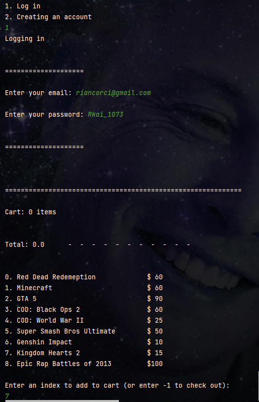
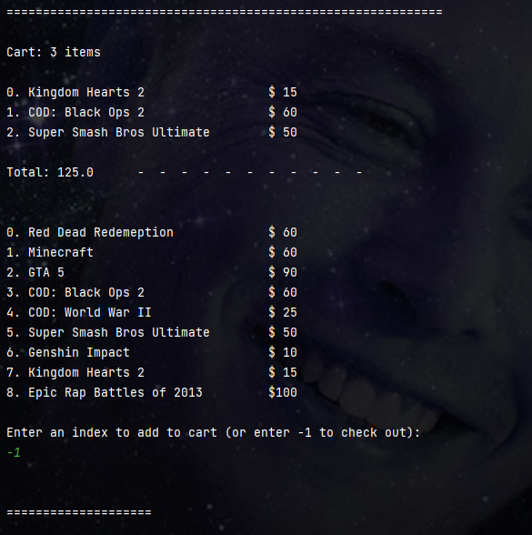
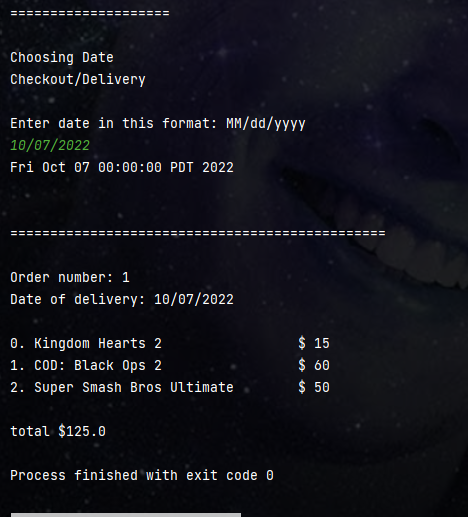

# GameStonks

1. This project was created using InteliJ
2. so run the program using inteliJ
 
**Objectives**
 
**Preview**

<table>
<tr>
<td width="25%">

Logging in

</td>
<td width="25%">

cart and catalogue

</td>
<td width="25%">

checkout and delivery

</tr>
<tr>
<td width="25%">
</img>
</td>
<td width="25%">
</img>
</td>
<td width="25%">
</img>
</td>
</tr>
</table>

## 🌟 Features

- [x] Creating an account
- [x] Logging in 
- [x] adding products to cart
- [x] getting receipt

**Addition/bugss**
- Rian Carinogen sucks. He is horrible!!!! He deserves an F. 
- Angel rules since he's a good programmer
- Joel rules.

